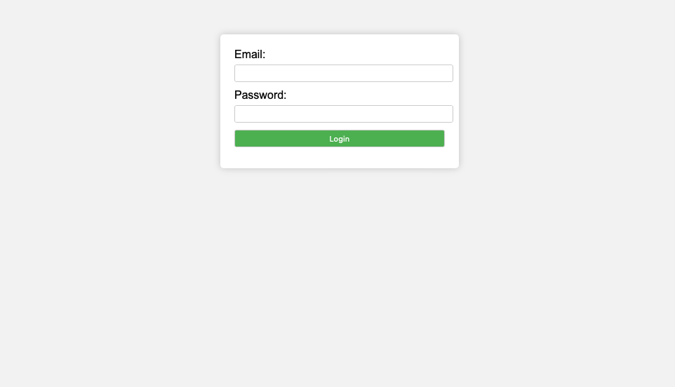
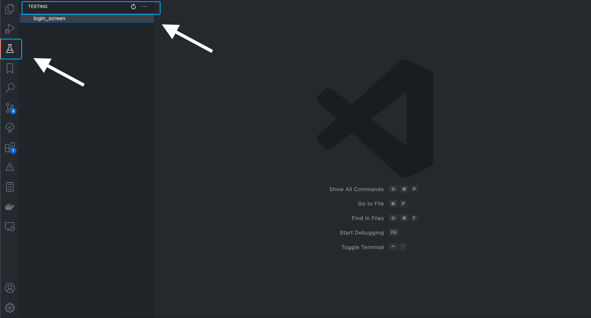
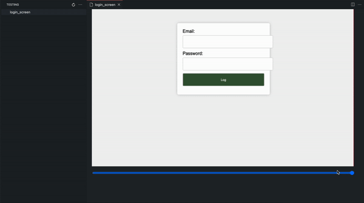

# golden-diff README

Easily compare golden failuers and check the diference.

This part of readme below will be updated as soon as possible.
## Features

This extension looks for image of golden test failures on your project, it's make a list with all the files reached.
By click on one it's possible see the difference between the expected image and the image that was generated by the golden toolkit,
this is pretty simple above the image has a slider that reveals the expected image above the failure.

Supose that we develop this screen:

We make some changes on theme and when run the tests it fails.

Here it's where the fails can be found:

This shows how easy is compare the images:

## Known Issues

I noticed that the list is not sorted, whe  you refresh sometimes the items will be on diferent order.

## Release Notes

Users appreciate release notes as you update your extension.

### 1.0.0

Initial release of Golden Test Failures

---

**Enjoy!**
